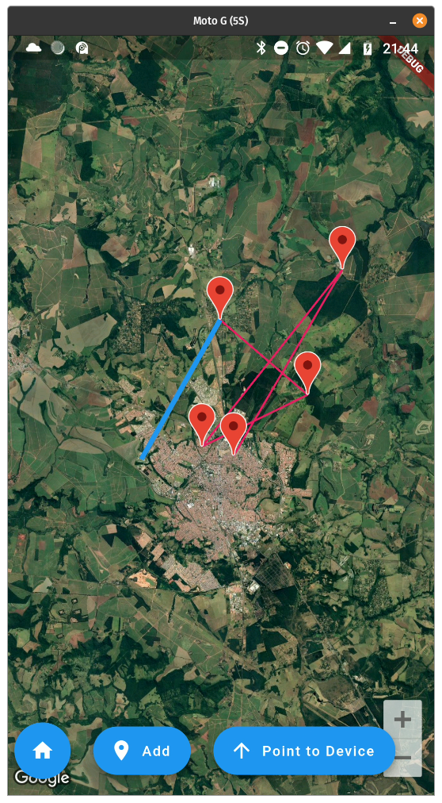
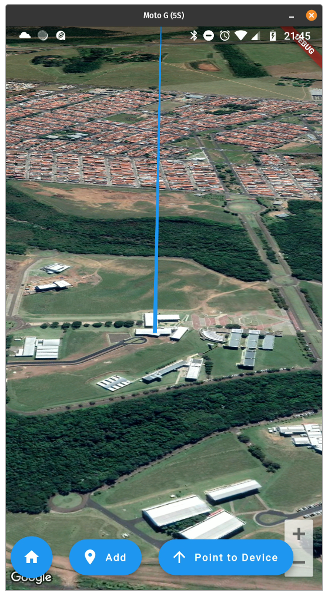

# Map Prototype

Main piece of the Zenith's App project 

## Features
Generates random places in São Carlos(SP), Brazil. The main target is to simulate the flight of a Space Probe.

## Note
Needs Goggle Maps API in `android/app/src/main/AndroidManifest.xml`

Reacts to the following events:

    - New device position (lat, lng, alt, speed)
    - New user position (lat, lng)

Displays the following information:
    - User's current location
    - Target's path
    

